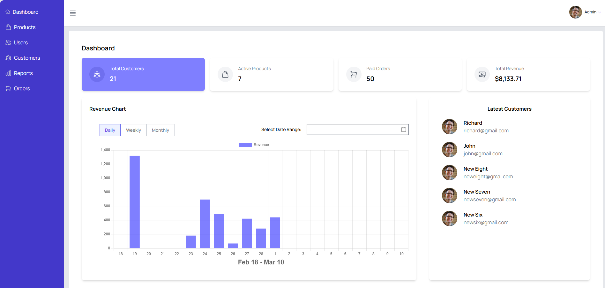
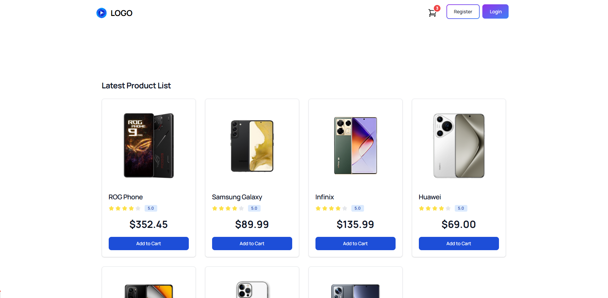

# 🛒 E-Commerce Website

## 📌 Overview
This is a **full-featured e-commerce website** built using **Vue** for the frontend and **Laravel** for the backend. The project aims to provide a seamless shopping experience for users while allowing administrators to efficiently manage products, orders, and customers.

---

## 🚀 Features
### 🛍️ User/Main Shop
✅ Product browsing  
✅ User authentication (registration & login)  
✅ Shopping cart functionality  
✅ Order placement  
✅ Payment gateway integration using **Stripe**  
✅ Responsive design with **Tailwind CSS**  

### 🛠️ Admin Panel
✅ Product management (**CRUD operations**)  
✅ Order management  
✅ Customer management  
✅ Dashboard with analytics  

---

## 🏗️ Technologies Used
- **Frontend:** Vue 3, Inertia (**User**), Vuex (**Admin**), Tailwind CSS
- **Backend:** Laravel
- **Database:** MySQL
- **Version Control:** Git, GitHub
- **Others:** Inertia.js (**User side**), Flowbite (**for UI components**), Tiptap (**Rich text editor**), Chart.js (**for data visualization**)

---

## 📷 Screenshots
### 🛠️ Admin Panel


### 🛠️ User Side



## 🛠️ Installation & Setup
### 📌 Prerequisites
Ensure you have the following installed:
- 📦 Node.js & npm
- 🐘 PHP & Composer
- 🗄️ MySQL (or your chosen database)

### 📂 Frontend Setup
### User Side
```sh
npm install
npm run dev
```

### Admin Side
```sh
cd backend
npm install
npm run dev
```

### ⚙️ Backend Setup
```sh
composer install  # For Laravel
php artisan serve  # Start backend server
```

---

## 🔮 Future Improvements
### ✨ User Features:
- ⭐ Wishlist & Favorites
- ⭐ Product Search, Reviews & Ratings
- 💬 Live Chat Support
- 🔥 Personalized Recommendations
- 🔄 Order Tracking, Cancellation & Refunds

### 📊 Admin Features:
- 🔑 Role-Based Access Control
- 📦 Inventory Management with Stock Alerts
- 📈 Sales & Revenue Reports
- 🎟️ Promo Codes & Discounts

### ⚡ Technical Improvements:
- 📱 PWA (**Progressive Web App**) Support
- 🌍 Multi-Currency & Multi-Language Support
- 🔍 SEO Optimization
- 🌙 Dark Mode Toggle

---


